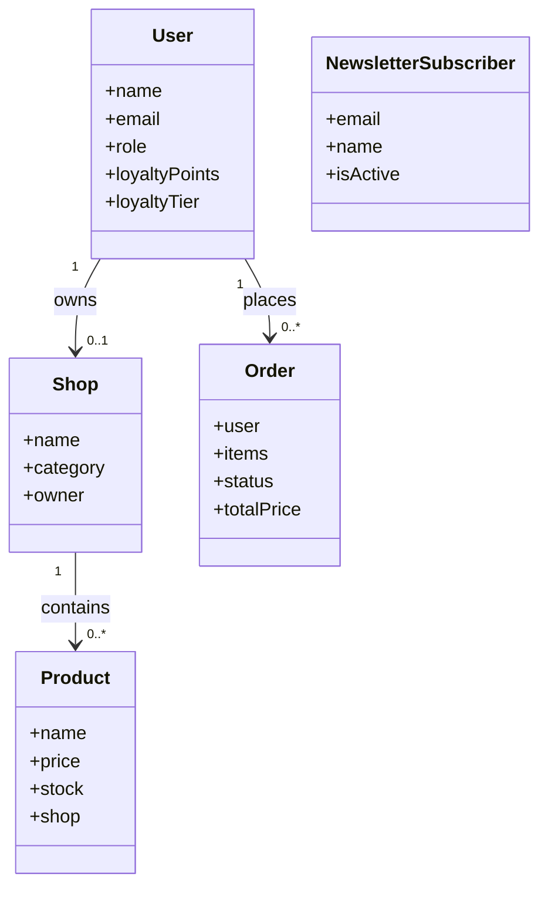

# PAGE DE GARDE

## Rapport Projet E-Commerce DZShop

- Etablissement: [A renseigner]
- Module: [A renseigner]
- Encadrant: [A renseigner]
- Realise par: [A renseigner]
- Annee universitaire: [A renseigner]

---

# 1. Introduction

Ce rapport presente la conception et la realisation d une application e-commerce full stack, avec gestion multi-roles, tableau de bord administrateur, gestion boutiques/produits/commandes et systeme newsletter.

---

# 2. Cahier des charges fonctionnel

## 2.1 Objectifs

- Permettre l achat de produits en ligne
- Permettre la gestion des boutiques
- Permettre la supervision administrative

## 2.2 Roles

- client: navigation, panier, commande, avis
- shopAdmin: gestion boutique + produits
- generalAdmin: supervision globale + statuts commandes + alertes stock

## 2.3 Dashboards

- Dashboard generalAdmin: KPI commandes, revenus, boutiques, produits, stock
- Dashboard shopAdmin: creation boutique, ajout/suppression produits

Ajoutez ici vos captures:

- Capture dashboard admin
- Capture dashboard shop admin

---

# 3. Diagramme de classe UML

Ajoutez ici:

- Une image exportee du diagramme UML

---

# 4. Technologies utilisees

| Categorie | Technologies |
|---|---|
| Front end | React, React Router, Axios, CSS |
| Backend | Node.js, Express, JWT, bcryptjs |
| Base de donnees | MongoDB, Mongoose |
| Editeur utilise | Visual Studio Code |
| Hebergement | [Non heberge / ou plateforme choisie] |

---

# 5. Architecture logicielle

## 5.1 Type d architecture

Le projet suit une architecture client-serveur en n-tiers:

- Couche presentation: frontend React
- Couche logique metier: API Express (controllers + middleware)
- Couche donnees: MongoDB (models Mongoose)

Pourquoi ce choix:

- Clarte de separation des responsabilites
- Facilite de test et maintenance
- Adaptation a un projet academique

## 5.2 Nature du systeme

Le systeme est principalement centralise:

- Une API centrale
- Une base de donnees centrale
- Un frontend client consommant cette API

Il n est pas microservices (pas de services deployes independamment).

---

# 6. Patrons architecturaux et patrons de conception

## 6.1 Patron architectural

- MVC simplifie (backend)

## 6.2 Patrons de conception observes

- Middleware pattern
- Route Guard pattern
- Provider/Context pattern
- Singleton module (instance Axios)

## 6.3 Captures de code a inserer

- middleware/auth.js (RBAC)
- middleware/errorHandler.js
- frontend/src/components/ProtectedRoute.js
- frontend/src/context/AuthContext.js
- frontend/src/api.js

---

# 7. Orientation composant et orientation objet

## 7.1 Orientation composant

Observee cote frontend:

- Components reutilisables (Navbar, ProductCard, ShopCard)
- Separation pages/composants

## 7.2 Orientation objet

Observee cote backend via modeles Mongoose:

- User, Shop, Product, Order, NewsletterSubscriber
- Encapsulation des regles de validation dans les schemas

Ajoutez ici:

- Captures de composants React
- Captures de schemas Mongoose

---

# 8. Structure des dossiers

Ajoutez ici une capture de l arborescence du projet.

Exemple simplifie:

- ecommerce/
  - backend/
    - controllers/
    - middleware/
    - models/
    - routes/
    - services/
  - frontend/
    - src/
      - components/
      - context/
      - screens/

---

# 9. Deploiement de l application

## 9.1 Strategie proposee

- Frontend: Vercel
- Backend: Render/Railway
- Base: MongoDB Atlas

## 9.2 Etapes

1. Build frontend
2. Configurer variables d environnement frontend/backend
3. Deployer API backend
4. Deployer frontend avec URL API
5. Tester flux complet (auth, produits, commandes)

## 9.3 Si deja heberge

Renseigner:

- URL frontend:
- URL backend:
- Plateforme:
- Date de deploiement:

---

# 10. Conclusion

Cette application repond aux besoins d une plateforme e-commerce pedagogique avec gestion multi-roles, architecture claire et extensible.

---

# 11. Livraison

- Envoyer ce rapport en PDF

Conseil export PDF:

- Ouvrir ce fichier markdown dans VS Code
- Utiliser un export PDF Markdown (ou impression PDF)
- Verifier la pagination de la page de garde
