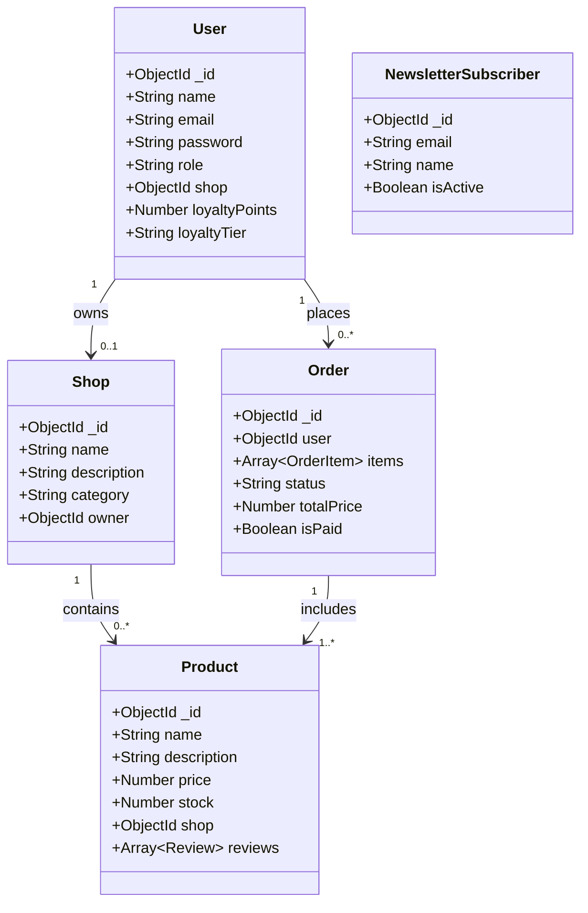

# DZShop - Application E-Commerce

## 1) Presentation

DZShop est une application e-commerce full stack avec:

- Gestion des utilisateurs et authentification JWT
- Gestion des boutiques et des produits
- Gestion des commandes et statuts de livraison
- Systeme de newsletter marketing
- Tableaux de bord pour les profils administrateurs

## 2) Modules du projet

- backend/: API REST, securite, logique metier, acces base de donnees
- frontend/: interface React, navigation, contextes d etat, dashboards

## 3) Roles et dashboards

- client:
	- Navigation des boutiques/produits
	- Ajout panier et passage de commande
	- Consultation de ses commandes
	- Ajout d avis produit (achat verifie)

- shopAdmin:
	- Dashboard boutique (creation boutique)
	- Gestion produits (ajout, suppression)

- generalAdmin:
	- Dashboard global administration
	- Visualisation stats commandes, produits, boutiques
	- Gestion des statuts de commande
	- Alertes stock faible/rupture

## 4) Architecture logicielle

- Style global: client-serveur
- Couches: architecture n-tiers (presentation, logique metier, donnees)
- Type: application centralisee et monolithique deployable (un frontend + une API)

Pourquoi:

- Separation claire entre interface utilisateur et API
- Maintenance plus simple pour un projet academique
- Evolution possible vers microservices plus tard

## 5) Patrons utilises

- Patron architectural:
	- MVC simplifie cote backend
		- Modeles: backend/models
		- Controleurs: backend/controllers
		- Routes/API: backend/routes

- Patrons de conception:
	- Middleware pattern (auth, gestion erreurs, securite)
	- Route guard pattern (ProtectedRoute cote frontend)
	- Provider/Context pattern (AuthContext, CartContext, LanguageContext)
	- Singleton module (instance API Axios partagee)

## 6) Diagramme UML (version textuelle)

Vous pouvez reutiliser ce diagramme dans votre rapport:

## 7) Lancement local

### Prerequis

- Node.js 18+
- npm
- MongoDB (local ou cloud)

### Backend

1. Aller dans backend/
2. Installer dependances: npm install
3. Creer .env avec au minimum:
	 - MONGO_URI=...
	 - JWT_SECRET=...
	 - NODE_ENV=development
	 - PORT=5001
4. Lancer: npm run dev

### Frontend

1. Aller dans frontend/
2. Installer dependances: npm install
3. Optionnel: definir REACT_APP_API_URL
4. Lancer: npm start

## 8) Deployment (proposition)

- Frontend: Vercel ou Netlify
- Backend: Render ou Railway
- Base de donnees: MongoDB Atlas

Statut actuel du repo:

- Ce depot contient le code de build frontend local
- Aucune preuve de deploiement cloud n est versionnee dans le code

## 9) Documents pour le rapport

Utiliser le modele pret a l emploi:

- RAPPORT_PDF_TEMPLATE.md

Et ajouter vos captures:

- Structure des dossiers
- Dashboards admin/shopAdmin
- Extraits de code des patrons (middleware, protected route, context)
